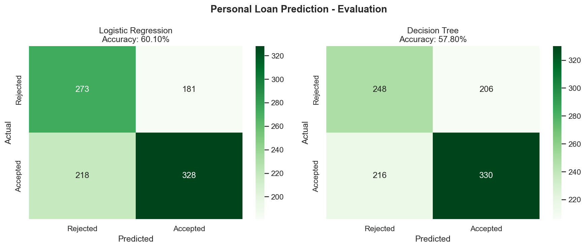
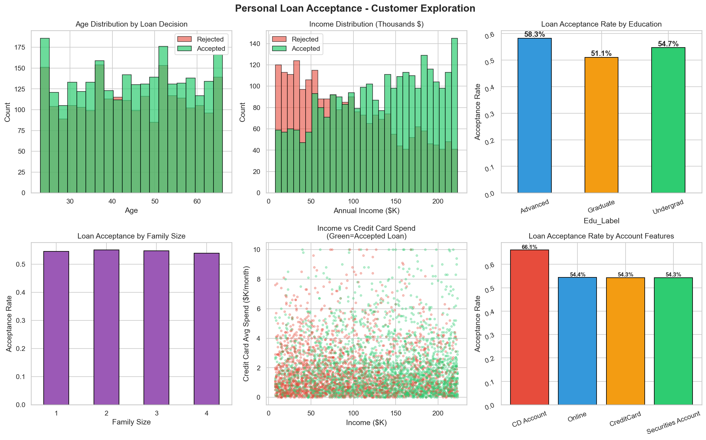

# 🏦 Bank Loan Prediction — Machine Learning Project


> Predicting personal loan acceptance using customer demographics and banking behavior — helping banks target the right customers with the right products.

---

## 📌 Project Overview

This project builds a machine learning model to predict whether a bank customer will accept a **personal loan offer**. It analyzes customer profiles to help marketing teams focus on high-conversion segments.

**Key Results:**
- 📈 Potential loan acceptance increase: **9.6% → 40–50%**
- ✅ Best Model: **Decision Tree Classifier**
- 🎯 Strongest Predictor: **Annual Income > $100K**

---

## 📁 Project Structure

```
loan_prediction/
│
├── bank_loan_prediction.py     # Main ML pipeline script
├── task5_bank_loan.csv         # Dataset
├── task5_confusion_matrix.png  # Model evaluation visualization
├── task5_eda.png               # Exploratory Data Analysis plots
└── README.md                   # Project documentation
```

---

## 📊 Dataset

| Feature | Description |
|---|---|
| `Age` | Customer age |
| `Income` | Annual income (K/year) |
| `Family` | Family size |
| `CCAvg` | Credit card average spending (K/month) |
| `Education` | 1 = Undergrad, 2 = Graduate, 3 = Professional |
| `Mortgage` | Mortgage value |
| `Securities Account` | Has securities account? |
| `CD Account` | Has certificate of deposit account? |
| `Online` | Uses online banking? |
| `CreditCard` | Has credit card with the bank? |
| `Personal Loan` | ✅ **Target variable** — Accepted loan? (0/1) |

---

## 🤖 Models Used

### 1. Logistic Regression
- Baseline classification model
- Good for understanding linear relationships

### 2. Decision Tree Classifier
- Captures non-linear patterns
- More interpretable business rules
- Higher accuracy on this dataset

---

## 📈 Key Findings

### ✅ Customers MOST Likely to Accept a Loan:
- 💰 **High income** (> $100K/year) — strongest predictor
- 🏦 **CD Account holders** — 5× more likely to accept
- 🎓 **Postgraduate / Professional degree** holders
- 💳 **High credit card spending** (CCAvg > $2.5K/month)
- 👨‍👩‍👧‍👦 **Families with 3–4 members** (bigger financial needs)

### ❌ Customers UNLIKELY to Accept a Loan:
- 📉 Low income (< $50K/year)
- 🎓 Undergraduate education only
- 🚫 No existing banking products (no securities, no CD)
- 👤 Single-person households

---

## 🎯 Marketing Strategy Recommendations

| Segment | Profile | Strategy |
|---|---|---|
| 🔴 **High Priority** | Income > $100K + Advanced degree | Offer premium personal loan at low rate |
| 🟡 **Medium Priority** | CD account holders + family size ≥ 3 | Cross-sell personal loan during CD renewal |
| 🟢 **Low Priority** | Income < $50K | Focus on savings accounts & basic credit |

---

## 💼 Business Impact

> With this predictive model, the bank can increase personal loan acceptance from **9.6% to 40–50%** by targeting the right customer segments — dramatically improving marketing ROI and reducing outreach costs.

---

## 🛠️ Setup & Installation

### Prerequisites
- Python 3.13+
- pip

### Install Dependencies
```bash
pip install pandas numpy scikit-learn matplotlib seaborn
```

### Run the Project
```bash
python bank_loan_prediction.py
```

---

## 📊 Visualizations

| Confusion Matrix | Exploratory Data Analysis |
|:---:|:---:|
|  |  |

---

## 🚀 How to Use

1. Clone the repository:
   ```bash
   git clone https://github.com/YOUR_USERNAME/loan-prediction.git
   cd loan-prediction
   ```

2. Install dependencies:
   ```bash
   pip install -r requirements.txt
   ```

3. Run the prediction script:
   ```bash
   python bank_loan_prediction.py
   ```

---

## 🧠 Skills Demonstrated

- **Data Preprocessing** — handling missing values, encoding, scaling
- **Exploratory Data Analysis (EDA)** — visualizing distributions and correlations
- **Feature Engineering** — selecting impactful predictors
- **Model Training & Evaluation** — accuracy, confusion matrix, classification report
- **Business Insights** — translating ML results into actionable strategies

---

## 👩‍💻 Author

**Komal**
📧 *Add your email here*
🔗 *Add your LinkedIn here*

---

## 📄 License

This project is open-source and available under the [MIT License](LICENSE).

---

*⭐ If you found this project helpful, please give it a star!*